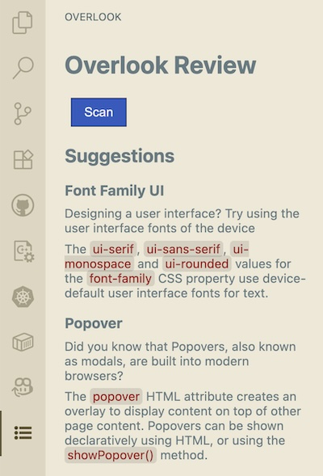
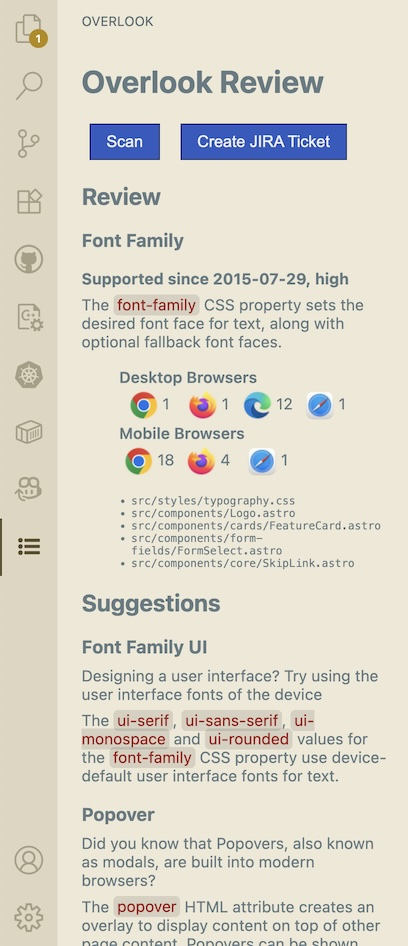
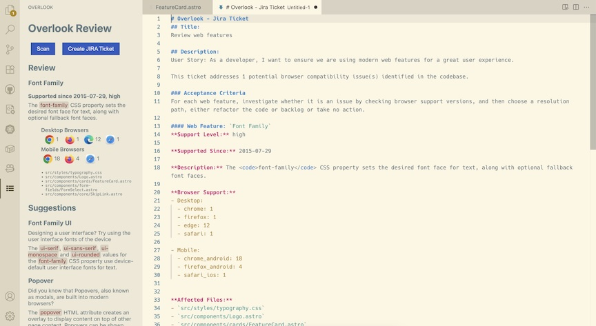

# Overlook extension for VS Code

CogniQ Overlook is a VS Code extension that offers a groundbreaking approach to reviewing web projects (React, Angular, Astro, Next.js, etc.) to encourage upgrading to modern web browser features.

The Overlook extension was created for the [Baseline Tooling 2025 Hackathon](https://baseline.devpost.com/)

[Baseline web-features NPM package](https://www.npmjs.com/package/web-features)

## Screenshots

